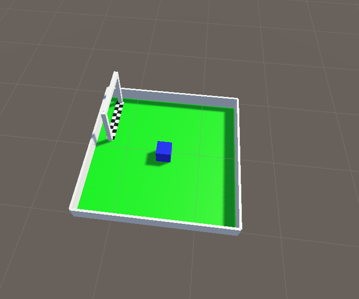
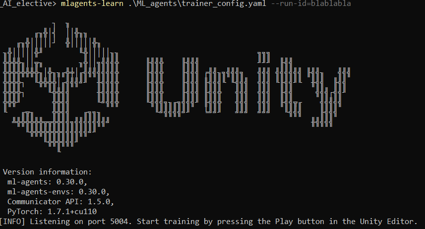

# AI Elective | Unity & MLAgents

> Welcome to the Unity & MLAgents workshop. In this workshop we will set up and play around with MLAgents in Unity. This tutorial is based on Unity's own tutorial at https://github.com/Unity-Technologies/ml-agents/blob/develop/docs/Getting-Started.md

## What is MLAgents?

> MLAgents is a framework you can use on top of Unity that allows you to teach your so-called Agent how to behave in your Unity environment. Behind the scenes, it uses Reinforcement Learning to reward desired behaviour (for example: scoring a goal in a soccer game), while punishing undesired behaviour (for example, scoring an own goal in a soccer game, or letting the other team score). 

## Getting Started 

### Setting up the environment

In order to get started, several things are needed:

 - Unity (version 2021.3 or later)
 - The `ml-agents` Unity package
 - `anaconda` (visit [anaconda.com/download](https://www.anaconda.com/download) and download the latest version)

Anaconda is a powerful environment / package management tool that is widely used in order to manage working with various (mostly python) packages. We will be using it to install pytorch (a python machine learning library) and other dependencies we need to run MLAgents in Unity.  

Now, after installing anaconda, run the program `anaconda powershell prompt`. The resulting screen should display something similar to this: `(base) PS C:\Users\Steven Warmelink>`. In this terminal, run the following commands in succession:

1. 
```
conda create -n 'AI_elective' python==3.8.13
```
2. 
```
conda activate AI_elective
```
3. 
```
python -m pip install mlagents==0.30.0
```
4. 
```
pip3 install torch~=1.7.1 -f https://download.pytorch.org/whl/torch_stable.html
```
5. 
```
pip3 install protobuf==3.20
```
6. 
```
pip install six
```
7.
```
mlagents-learn --help
```

At this point, you should see the mlagents help text. This should be enough to get started in Unity!

### Creating a Unity Scene

To make things easier, you can download the initial scene setup from (this) github:

```
git clone https://github.com/StevenWarmelink/CMGT_AI_elective.git
```

Open up the newly downloaded unity scene, it's under Assets > BigArena. It should look roughly like this:



Now, in the directory where you downloaded or cloned the git repository, you should find a folder named `ML_agents`. This folder should contain a file called `trainer_config.yaml`, which is our main configuration file for the reinforcement training process. 

Now, navigate to this folder in your conda environment using `cd ML_agents`. You can start the training using the following command:

```
mlagents-learn trainer_config.yaml --run-id=myFirstRun
```

In this case `trainer_config.yaml` contains the configuration for our reinforcement learning model, and `myFirstRun` is the name / identifier that we use for this training session. After running the command, you should see something like this:



That means your setup is all correct! You can now begin training by pressing the 'play' button in Unity itself. 

### Training / tuning the agent behaviour

There are several moving parts in this Unity project

> The GameManager allows you to spawn good (green) pellets and bad (red) pellets, and determines the arena size. These can change the environment you want the agent to operate in. 

> The Agent object is where the magic happens. It has 3 vital parts:
 - The `MyAgent.cs` C# script determines when / where / how the agent is punished or rewarded. Initially, all of the rewards are set to 0, meaning the agent doesn't get any information about what behaviour is desired or not. 
 - The Ray Perception 3D component, which gives the agent information about the world through raycasting and tags of objects the raycasts hit. 
 - The Behaviour Parameters component contains most information necessary for the `mlagents-learn` script to function: how many observations do you get per time step, how many actions does the agent receive from the model, and the option to use a trained model (mode about that later). For now, these settings are configured correctly and don't have to be tampered with.  

If your mlagents script is done training, it will produce a `.onnx` file, which you can then drag into the Behaviour Parameters field called `Model`. This model has saved the behaviour that you have been training over time, and it allows you to save and share the trained behaviour.

# FAQ


### *I get the following error: `mlagents.trainers.exception.UnityTrainerException: Previous data from this run ID was found. Either specify a new run ID, use --resume to resume this run, or use the --force parameter to overwrite existing data.` What's going on / How do I fix it?*

> You were training beforehand with an identical run-id. Change your run-id in the command when you run 

```
mlagents-learn trainer_config.yaml --run-id=YOURNAME
```

If you paused or aborted your previous run, you can resume it instead by adding --resume, for example: 

```
mlagents-learn trainer_config.yaml --resume --run-id=myFirstRun
```

Finally, if you just want to throw away your previous run and overwrite it, you can do so by using the `--force` parameter as such:
```
mlagents-learn trainer_config.yaml --force --run-id=myFirstRun
```

### *My agent is only doing random moves and not getting any better over time. How can I improve it?*

> In general terms, the agent will perform behaviours that gave it a positive reward more often, and reduce the moves that give it a negative reward. In the code (`myAgent.cs`), this is done whenever the `addReward()` function is called. Initially, all rewards are set to 0; play around with giving desired baviour positive rewards (`addReward(2f)`) and undesired behaviour negative rewards (`addReward(-2f)`).

*I can't get mlagents to run, it just gives me unintelligble errors; what can I do?*

> If you have a Mac, you may encounter some issues with pytorch and other MLAgents dependencies. In this case, a possible workaround may be to use the `requirements.txt` file you can find on the repository in the `ML_agents` folder. To use it, run the following in your conda environment in the folder ML_agents:
```pip install -r requirements.txt```

### *I want to use my trained model, how do I use it?*

> If your training is finished, it should output a MyAgent.onnx file in the `CMGT_AI_elective/ML_agents/results/MY_RUN_ID/` folder in the location where you downloaded the repository. You can add this .onnx file to your project assets, select the `Agent` object in the `TrainingArea` object in your hierarchy, and in the Inspector drag your `.onnx` file into the 'Model' slot (see screenshot). 


If you press play now, the agent should show the behaviour it learned during training. 

### *Why is my trained agent so much slower than what I saw during training?*

> During training, Unity is sped up so that training can go faster than real-time; otherwise it would take a very long time for the agent to train - this is expected behaviour!

### *My training is taking ages, how can I speed it up?*

> By default, the training lasts for 100.000 training episodes. You can configure this by editing the `trainer_config.yaml` file, and changing the `max_steps` parameter to a smaller number. If you want more frequent updates on the training itself, you can reduce the `summary_freq` field to a lower number. 
